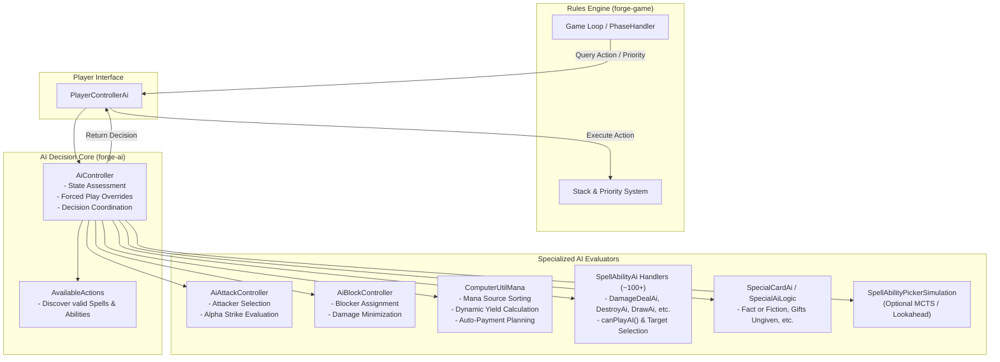
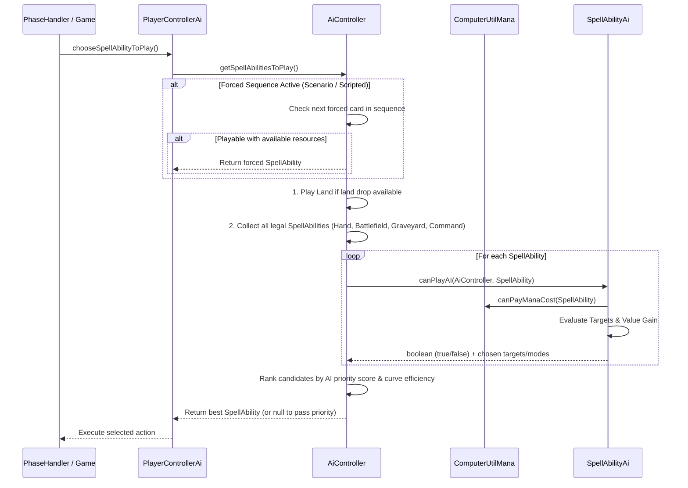

# Forge AI Decision Making — Conceptual & Architectural Guide

## 1. Overview & Philosophy

Forge's Artificial Intelligence is a **heuristic-based expert system** rather than a neural network or machine learning model. It uses deterministic rule-based evaluations, mathematical board-state heuristics, and situational scoring to play Magic: The Gathering according to the official Comprehensive Rules.

### Core Principles

1. **Separation of Rules Engine & Decision Agent**:
   * The core rules engine (`forge-game`) is completely agnostic of whether a player is human, AI, or a remote network client.
   * Communication occurs strictly through the [`PlayerController`](file:///C:/SWProjects/Forge/forge-game/src/main/java/forge/game/player/PlayerController.java) interface.
2. **Phase-Driven Decision Loop**:
   * The AI evaluates actions when receiving priority across game phases (Untap, Upkeep, Draw, Pre-Combat Main, Combat, Post-Combat Main, End of Turn, Cleanup).
3. **Modular Ability Handlers**:
   * Each card effect API (`AB$`, `SP$`, `DB$`, `ST$`) in card scripts maps to a corresponding [`SpellAbilityAi`](file:///C:/SWProjects/Forge/forge-ai/src/main/java/forge/ai/SpellAbilityAi.java) handler (e.g. `DamageDealAi`, `DestroyAi`, `DrawAi`, `CountersPutAi`).
4. **Multi-Tiered Fallbacks**:
   * **Forced Sequence / Playbook** (if scripted in scenarios or forced overrides) $\rightarrow$
   * **Specialized Card AI** (for complex tutor/choice cards) $\rightarrow$
   * **Ability-Specific Heuristics** $\rightarrow$
   * **General Utility Evaluation** (`ComputerUtil*`).

---

## 2. High-Level AI Architecture

---

## 3. Core Decision Pipelines

### 3.1 Priority & Main Phase Play Pipeline

When the AI receives priority in a Main Phase (`chooseSpellAbilityToPlay`), the workflow proceeds as follows:

### 3.2 Combat Decision Pipeline

Combat is divided into two distinct controllers:

#### 1. Attacker Declaration ([`AiAttackController`](file:///C:/SWProjects/Forge/forge-ai/src/main/java/forge/ai/AiAttackController.java))
* **Alpha Strike Check**: Computes if attacking with all creatures deals lethal unblockable/trample damage to an opponent.
* **Combat Math Evaluation** ([`ComputerUtilCombat.combatMath()`](file:///C:/SWProjects/Forge/forge-ai/src/main/java/forge/ai/ComputerUtilCombat.java)):
  * Simulates opponent blocking scenarios.
  * Evaluates creature survival rates, favorable trades, and vigilance value.
  * Checks evasion keywords (Flying, Shadow, Menace, Unblockable, Islandwalk, Trample, Deathtouch).
* **Aggression Weighting**: Personality parameters (`AggressionLevel` from `.ai` profile) adjust willingness to trade creatures for opponent life damage.

#### 2. Blocker Declaration ([`AiBlockController`](file:///C:/SWProjects/Forge/forge-ai/src/main/java/forge/ai/AiBlockController.java))
* **Threat Prioritization**: Identifies high-damage threats, Commander damage thresholds, and must-kill utility creatures.
* **Profitable & Neutral Trades**: Prioritizes killing attacking creatures while preserving AI board state.
* **Chump Blocking**: Calculates whether incoming damage is lethal or puts AI into dangerous life totals before assigning chump blockers.

---

## 4. Key AI Modules & Responsibilities

| Class / Package | Primary Responsibility |
| :--- | :--- |
| [`AiController`](file:///C:/SWProjects/Forge/forge-ai/src/main/java/forge/ai/AiController.java) | Central orchestrator. Manages phase flow, forced play sequences, cache state, and top-level action selection. |
| [`PlayerControllerAi`](file:///C:/SWProjects/Forge/forge-ai/src/main/java/forge/ai/PlayerControllerAi.java) | Implements Forge rules engine interface. Translates engine queries into AI method calls. |
| [`ComputerUtil`](file:///C:/SWProjects/Forge/forge-ai/src/main/java/forge/ai/ComputerUtil.java) | General heuristics: evaluates creature strength, permanent scores, removal value, threat assessment. |
| [`ComputerUtilMana`](file:///C:/SWProjects/Forge/forge-ai/src/main/java/forge/ai/ComputerUtilMana.java) | Mana calculations, source ranking, dynamic yield evaluation, cost payment sequencing. |
| [`ComputerUtilCombat`](file:///C:/SWProjects/Forge/forge-ai/src/main/java/forge/ai/ComputerUtilCombat.java) | Combat simulation, trade assessment, lethal damage calculations, blocker simulation. |
| [`ComputerUtilCard`](file:///C:/SWProjects/Forge/forge-ai/src/main/java/forge/ai/ComputerUtilCard.java) | Card valuation, filtering, sorting, best/worst permanent selection. |
| [`ComputerUtilCost`](file:///C:/SWProjects/Forge/forge-ai/src/main/java/forge/ai/ComputerUtilCost.java) | Additional cost evaluation (sacrifice selection, discard selection, delve/convoke). |
| `forge.ai.ability.*` | ~100+ specialized API effect handlers (`DamageDealAi`, `DestroyAi`, `DrawAi`, `ChangeZoneAi`, etc.). |
| [`SpecialCardAi`](file:///C:/SWProjects/Forge/forge-ai/src/main/java/forge/ai/SpecialCardAi.java) / [`SpecialAiLogic`](file:///C:/SWProjects/Forge/forge-ai/src/main/java/forge/ai/SpecialAiLogic.java) | Hardcoded overrides for iconic cards requiring non-generic multi-step decision trees. |
| [`AiDecisionLogger`](file:///C:/SWProjects/Forge/forge-ai/src/main/java/forge/ai/AiDecisionLogger.java) | Captures candidate options, scores, and chosen rationale for analytics and replay JSON. |

---

## 5. Mana & Resource Management

Mana source evaluation in [`ComputerUtilMana.java`](file:///C:/SWProjects/Forge/forge-ai/src/main/java/forge/ai/ComputerUtilMana.java) determines how the AI pays for spells without wasting dynamic or high-yield mana:

1. **Mana Source Classification**:
   * Basic Lands $\rightarrow$ Dual / Tri Lands $\rightarrow$ Artifact / Enchantment Mana $\rightarrow$ Mana Dorks $\rightarrow$ Dynamic Yield Abilities $\rightarrow$ Single-use / Sacrificial Sources (Lotus Petal, Treasures).
2. **Dynamic Yield Prioritization**:
   * Abilities producing dynamic amounts (e.g. *Arbor Adherent* producing $X = \text{greatest toughness}$) are calculated dynamically and prioritized over fixed 1-mana abilities on the same permanent.
3. **Floating Mana Utilization**:
   * Mana already in the pool is spent first before tapping new permanents.
4. **Color Identity & Requirement Matching**:
   * Restrictive mana requirements (e.g. triple colored symbols) are preserved by reserving multi-color sources.

---

## 6. AI Personality Profiles (`res/ai/*.ai`)

Forge AI behavior can be tuned per match or deck archetype via configuration profiles located in [`forge-gui/res/ai/`](file:///C:/SWProjects/Forge/forge-gui/res/ai/):

| Parameter | Type | Default | Description |
| :--- | :--- | :--- | :--- |
| `AggressionLevel` | Integer (1–5) | `3` | How aggressively the AI attacks and races for damage vs holding blockers. |
| `TradeThreshold` | Double | `1.0` | Minimum value ratio required to accept trading a creature in combat. |
| `LifeDangerThreshold` | Integer | `8` | Life total at which defensive blocking takes extreme priority over attacking. |
| `MulliganModel` | String | `Standard` | Opening hand evaluation model (e.g. Paris, London, Decklist-Aware). |
| `SimulationDepth` | Integer | `0` | Depth of lookahead simulation when `SpellAbilityPickerSimulation` is active. |

---

## 7. Decision Logging & Analytics

To enable game learning, blunder detection, and replay analysis:
* Every decision point evaluates all available candidate plays.
* The chosen play, along with considered alternatives and score rationale, is recorded via [`AiDecisionLogger`](file:///C:/SWProjects/Forge/forge-ai/src/main/java/forge/ai/AiDecisionLogger.java).
* These choices are exported directly into the Level 1 and Level 2 streams of the **MTG Replay Notation JSON** (`views_l2` and `events`).
